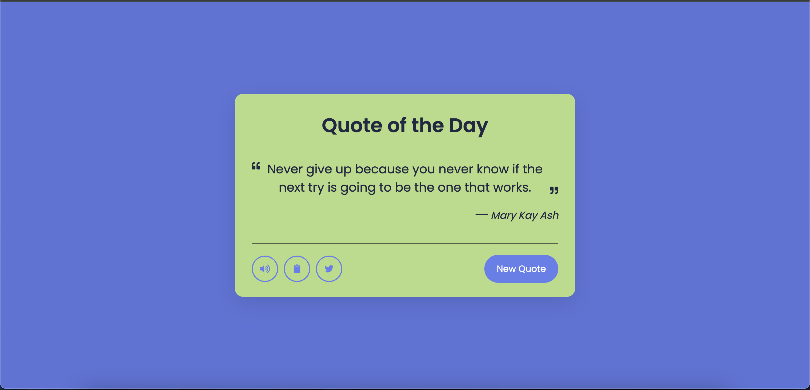

# Quote Generator

This project is a simple web-based quote generator built using HTML, CSS, and JavaScript. It provides a straightforward way to display random quotes to users with a clean and minimalistic design. The generator also includes additional features such as a voice reading option and copy to clipboard functionality.

## Installation

1. **Clone the Repository:**
git clone https://github.com/Shruti192903/Quote_Generator.git

2. **Navigate to the Project Directory:**

## Usage

1. **Open the `index.html` File:**
Open the `index.html` file in your preferred web browser. You can simply double-click on the file or right-click and choose "Open with" to select your browser.

2. **Generate Quotes:**
Once the web page is loaded, you'll see a "New Quote" button. Click on it to display a random quote.

3. **Voice Feature:**
- After generating a quote, click on the "Speaker" icon to hear the quote loud.
- Utilizes the Web Speech API for text-to-speech conversion directly in the browser.
 
4. **Copy to Clipboard:**
- Next to each displayed quote, there is a "Clipboard" icon. Clicking this button copies the quote text to your clipboard.

- **Styling:**
Feel free to modify the CSS styles in the `style.css` file to match your desired look and feel.

- **Output:**

  
  
